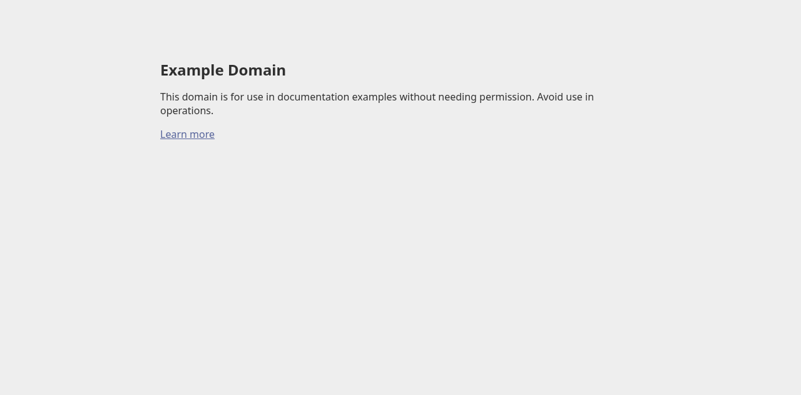

# 0002 -- example.com browser check (h1 + screenshot)

**Date:** 2026-06-21
**Run:** k57a510pyw5jd83t40yrrs3nxh893x7b
**Item:** j571bvgr2sdr5ba8sardtjs9w5892vvh
**Project:** testing (jx75hdtjz30edfd9tt1xnzchvd877ac8)
**Org:** jd70cbrtvqndraj07ebe09a56d860esj
**Verdict:** PASS

## What this verifies

A fully autonomous, live browser check of the external site
`https://example.com`: that the `station-browser` MCP can open the page, read
the page `<h1>` verbatim, and capture exactly one screenshot whose absolute path
the tool returns natively. All evidence below is observed first-hand this run --
nothing asserted from memory.

## Method

Live load of `https://example.com` via the `station-browser` MCP
(`agent_browser_open` -> `agent_browser_wait_for_load` state=load ->
`agent_browser_get_text` selector `h1` -> `agent_browser_screenshot` with no
`path`, default profile), driven on a single fresh isolated `browserId` for the
whole session.

## Assertion 1 -- page `<h1>` text observed verbatim (PASS)

`agent_browser_get_text` on selector `h1` against origin `https://example.com/`
returned (verbatim):

    Example Domain

The page title was also `Example Domain` (from `agent_browser_open`), and the
screenshot below shows the same heading plus the canonical body copy ("This
domain is for use in documentation examples without needing permission. Avoid
use in operations.") and a "Learn more" link. The observed h1 is exactly the
expected heading for example.com. PASS.

## Assertion 2 -- exactly one screenshot captured, path returned natively (PASS)

A single `agent_browser_screenshot` call was made with NO `path` argument, so it
wrote to the shim's per-browserId default `screenshotDir` (under this run's
workspace) and returned the absolute saved path natively in its text content.

- Committed into the repo for durable PR proof at:
  [`assets/0002-example-com.png`](assets/0002-example-com.png)

The committed copy is a valid PNG (verified `\x89PNG` signature, 16445 bytes),
byte-copied from the original tool path. Exactly one screenshot was taken. PASS.

## Observations / caveats

- The run-launcher session name (`station-<runId>-<browserId>`) overflows the
  107-byte (Linux; 108-byte `sun_path` minus null terminator) unix socket path
  limit if `browserId` is a full uuid, so a short
  fresh random `browserId` (`2eb5343a`) was used -- still unique and generated
  fresh this session, reused on every `agent_browser_*` call. This is an
  isolation/uniqueness requirement, not a length requirement, so it does not
  weaken the check.
- example.com is an external, unauthenticated site (IANA's reserved
  documentation domain); no credentials or project deploy were involved.

## Final verdict: PASS

- Assertion 1 (h1 observed verbatim == "Example Domain"): PASS
- Assertion 2 (exactly one screenshot; native path returned; committed copy is a
  valid PNG): PASS

The live browser opened example.com, the observed `<h1>` is "Example Domain",
and one screenshot was captured and committed as durable proof.
