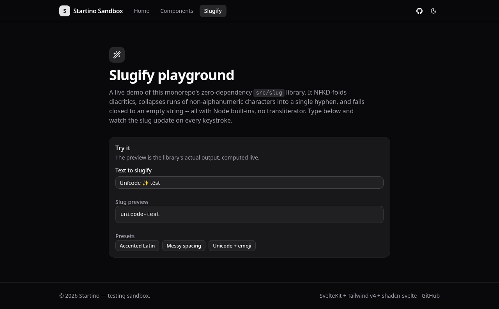

# 0003 -- /playground/slugify route (live browser check)

**Date:** 2026-07-10
**Run:** k576b29wtq2mvmgwq4m0fch6ws8a901d
**Item:** j571xp854r1kr637bkc7j1ytz18a8ee7
**Project:** testing (jx75hdtjz30edfd9tt1xnzchvd877ac8)
**Org:** jd70cbrtvqndraj07ebe09a56d860esj
**Verdict:** PASS

## What this verifies

The new `/playground/slugify` route: that it renders, its live preview updates on
every keystroke, its preset buttons drive the preview, and -- critically -- that
the slug it shows is produced by the SHIPPED `src/slug/slug.mjs` library, not a
divergent copy. All evidence below is observed first-hand this run against a real
browser hitting an isolated dev server (`127.0.0.1:5199`, NOT prod vite :5173).

## Method

Live load via the `station-browser` MCP on a single fresh isolated `browserId`:
`agent_browser_open` -> `agent_browser_fill` the input -> `agent_browser_get_text`
on the preview -> `agent_browser_click` a preset -> `agent_browser_get_text`
again -> `agent_browser_screenshot`. The dev server ran `vite dev` on the
feature worktree.

## Assertion 1 -- live preview reflects the library's unicode-aware output (PASS)

Typed into the "Text to slugify" input (verbatim):

    Café René & Jürgen  —  Live!

The preview (`[data-testid="slug-output"]`) read back (verbatim):

    cafe-rene-jurgen-live

Diacritics were NFKD-folded (Café -> cafe, Jürgen -> jurgen), the em-dash and
ampersand and repeated spaces all collapsed to single hyphens, and no
leading/trailing separator remained. This is the shipped module's behavior --
the old web-local copy did NOT fold diacritics. PASS.

## Assertion 2 -- preset button drives the preview to the canonical slug (PASS)

Clicked the "Unicode + emoji" preset (loads `Ünïcode ✨ tëst`). The preview read
back (verbatim):

    unicode-test

This exactly matches what `node -e 'slugify("Ünïcode ✨ tëst")'` produces from
`src/slug/slug.mjs` (Ü->u, ï->i, ë->e; the ✨ emoji is a delimiter). The
screenshot below captures this exact state: nav "Slugify" active, the `src/slug`
chip in the description, the input holding `Ünïcode ✨ tëst`, and the preview
showing `unicode-test`. PASS.

- Committed into the repo for durable PR proof at:
  [`assets/0003-slugify-playground.png`](assets/0003-slugify-playground.png)

## Assertion 3 -- shared source of truth, machine-checked (PASS)

`web/src/lib/slugify.ts` is a thin re-export of `src/slug/slug.mjs` (no copied
algorithm). `web/src/lib/slugify.test.ts` asserts the web adapter equals the
canonical library byte-for-byte across every `src/slug/fixtures.mjs` case AND on
all three demo presets. Full web suite: 27 tests pass. The canonical library's
own suite (`src/slug`, `node --test`): 13 tests pass (unchanged by the
type-narrowing edit to its `maxLength` guard). PASS.

## Observations / caveats

- The `station-browser` session name (`station-<runId>-<browserId>`) overflows
  the ~103-byte unix socket path limit if `browserId` is a full uuid, so a
  short fresh `browserId` (`slugvfy1`) was used -- unique and generated fresh
  this session, reused on every `agent_browser_*` call. Isolation is preserved.
- CI (`node scripts/test-all.mjs`) covers `src/<module>` packages, so it runs
  the `src/slug` change but not the `web` vitest suite; the web suite is
  validated by `cd web && npm test` locally (27 pass) plus this browser check.

## Final verdict: PASS

- Assertion 1 (live preview, unicode-aware): PASS
- Assertion 2 (preset -> canonical slug, screenshotted): PASS
- Assertion 3 (shared source of truth, tests green): PASS
